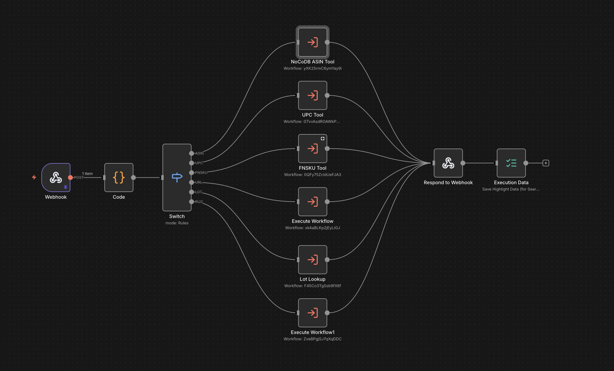
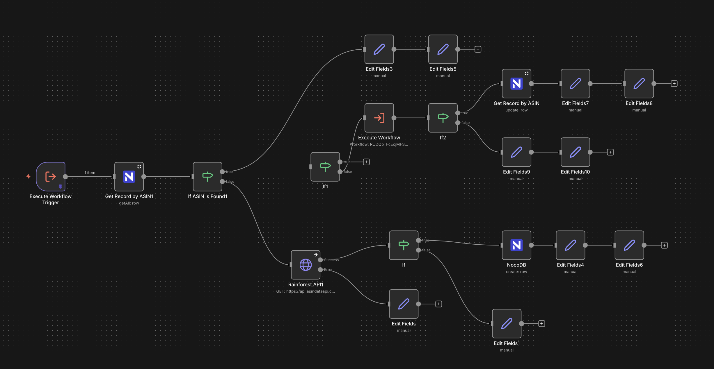
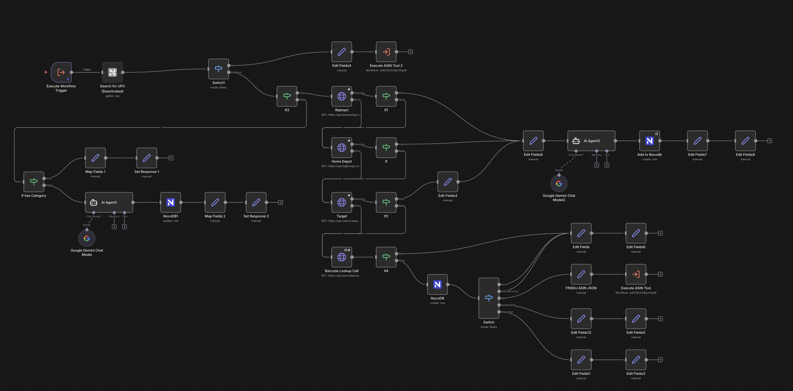
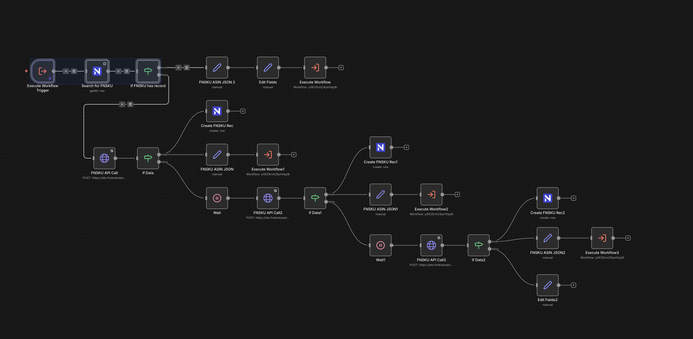
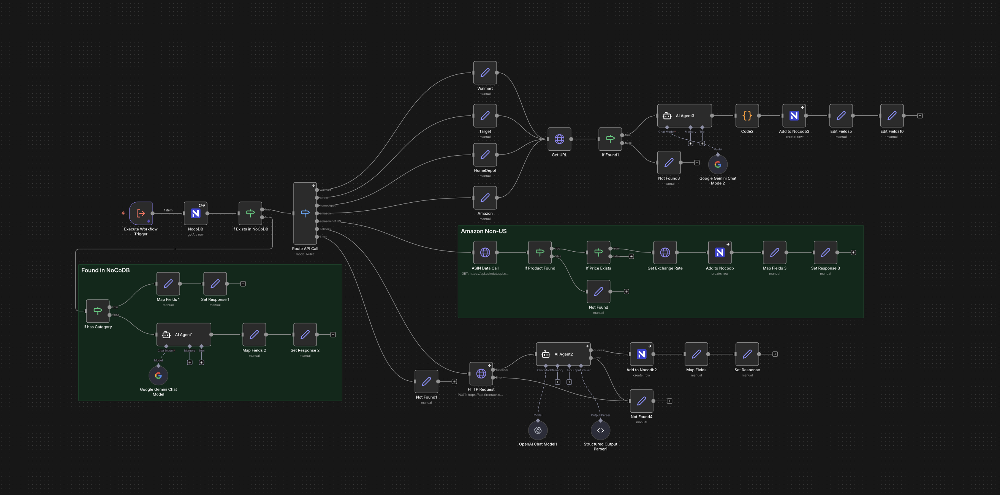
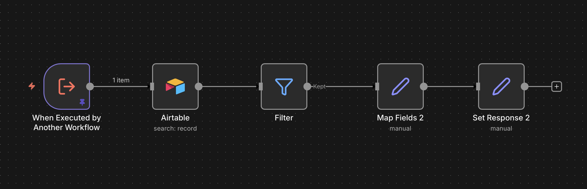

# Product Info Lookup API


[](./screenshots/main-workflow.png)

A unified product information lookup API that automatically detects identifier types (ASIN, UPC, FNSKU, URL, LOT) and retrieves comprehensive product data from multiple retail sources including Amazon, Walmart, Target, and Home Depot.

## What I Built

- **Universal Barcode Router** - Intelligent input detection that automatically identifies and routes ASINs, UPCs, FNSKUs, URLs, and internal lot numbers to appropriate lookup workflows
- **Multi-Retailer API Integration** - Unified interface to Amazon, Walmart, Target, and Home Depot product APIs with automatic source detection from URLs
- **Smart Caching Layer** - NocoDB-backed caching system that stores product data to minimize API calls and reduce costs
- **FNSKU to ASIN Conversion** - Amazon Fulfillment Network SKU resolution with retry logic and persistent caching
- **AI-Powered Data Extraction** - Fallback web scraping with Firecrawl + GPT-4/Gemini for extracting product details when APIs fail
- **AI Product Categorization** - Automatic category assignment using Google Gemini for consistent taxonomy across sources
- **Inventory Integration** - Airtable lookup for internal lot numbers linking to existing inventory management

## Demo

### Main Workflow - Identifier Router

The main workflow receives a `mixedID` via webhook, detects the identifier type using pattern matching, and routes to the appropriate sub-workflow:

[](./screenshots/main-workflow.png)

### ASIN Tool - Amazon Product Lookup

Fetches product data from Amazon by ASIN with intelligent caching and automatic price updates:

[](./screenshots/asin-tool-workflow.png)

### UPC Tool - Barcode Lookup

Multi-source barcode lookup across Walmart, Target, Home Depot, and barcode databases with AI categorization:

[](./screenshots/upc-tool-workflow.png)

### FNSKU Tool - Amazon FBA Identifier Resolution

Converts Amazon FNSKU codes to ASINs with retry logic for pending lookups:

[](./screenshots/fnsku-tool-workflow.png)

### URL Tool - Retailer URL Scraper

Extracts product information from retailer URLs with AI-powered fallback scraping:

[](./screenshots/url-tool-workflow.png)

### Lot Lookup - Inventory Integration

Retrieves product data from Airtable inventory by internal lot number:

[](./screenshots/lot-lookup-workflow.png)

## Architecture

```
                                    ┌─────────────────┐
                                    │  NoCoDB ASIN    │
                                    │     Tool        │
                                    └────────┬────────┘
                                             │
┌──────────┐    ┌──────────┐    ┌────────┐  │  ┌─────────────────┐
│  Webhook │───▶│   Code   │───▶│ Switch │──┼──│    UPC Tool     │
│  (POST)  │    │ (Detect) │    │ (Route)│  │  └─────────────────┘
└──────────┘    └──────────┘    └────────┘  │
                                            │  ┌─────────────────┐
                                            ├──│   FNSKU Tool    │
                                            │  └─────────────────┘
                                            │
                                            │  ┌─────────────────┐
                                            ├──│    URL Tool     │
                                            │  └─────────────────┘
                                            │
                                            │  ┌─────────────────┐
                                            └──│   Lot Lookup    │
                                               └─────────────────┘
```

**Process Flow:**

1. **Webhook** receives POST request with `mixedID` parameter
2. **Code Node** analyzes input using regex patterns to detect identifier type
3. **Switch** routes to appropriate sub-workflow based on detected type
4. **Sub-workflows** fetch product data from APIs, cache results, and apply AI categorization
5. **Response** returns unified product object with standardized fields

## Supported Identifier Types

| Type | Pattern | Example | Data Sources |
|------|---------|---------|--------------|
| ASIN | Starts with `B0` | `B0DPMXVGJB` | Amazon API |
| UPC | 7-8 or 10-14 digits | `012345678901` | Walmart, Target, Home Depot, Barcode Lookup |
| FNSKU | Starts with `X0` | `X003Y2IPC7` | FNSKU-to-ASIN API → Amazon |
| URL | Valid HTTP(S) URL | `https://amazon.com/dp/...` | Retailer APIs, Firecrawl |
| LOT | 6 digits | `218229` | Airtable Inventory |

## Repository Structure

```
product-info-lookup/
├── README.md
├── screenshots/
│   ├── main-workflow.png
│   ├── asin-tool-workflow.png
│   ├── upc-tool-workflow.png
│   ├── fnsku-tool-workflow.png
│   ├── url-tool-workflow.png
│   └── lot-lookup-workflow.png
└── workflows/
    ├── product-lookup-main.json
    ├── asin-tool.json
    ├── upc-tool.json
    ├── fnsku-tool.json
    ├── url-tool.json
    └── lot-lookup-tool.json
```

## Tech Stack

| Component | Technology | Purpose |
|-----------|------------|---------|
| Orchestration | n8n | Workflow automation and API routing |
| Database | NocoDB | Product data caching and deduplication |
| Inventory | Airtable | Internal lot number and inventory lookup |
| Amazon Data | ASIN Data API | Product details, pricing, categories |
| Walmart Data | BlueCart API | Walmart product information |
| Target Data | RedCircle API | Target product information |
| Home Depot Data | BigBox API | Home Depot product information |
| Barcode Lookup | Barcode Lookup API | UPC/EAN product database |
| FNSKU Resolution | FNSKUtoASIN API | Amazon fulfillment code conversion |
| Web Scraping | Firecrawl | Fallback URL scraping |
| AI Extraction | OpenAI GPT-4 | Structured data extraction from scraped content |
| AI Categorization | Google Gemini | Automatic product categorization |

## Example Request

```bash
curl -X POST https://your-n8n-instance/webhook/product-lookup \
  -H "Content-Type: application/json" \
  -d '{"mixedID": "B0DPMXVGJB"}'
```

**Response:**
```json
{
  "success": true,
  "response": {
    "Product": "Example Product Name",
    "ASIN": "B0DPMXVGJB",
    "Link": "https://amazon.com/dp/B0DPMXVGJB",
    "Image": "https://images-na.ssl-images-amazon.com/...",
    "MSRP": 29.99,
    "Categories": "Electronics, Accessories",
    "Description": "Product description..."
  }
}
```

## Setup

1. **Import Workflows** - Import the JSON files from `/workflows` into your n8n instance
2. **Configure Credentials**:
   - NocoDB API token
   - Airtable API key
   - ASIN Data API key
   - BlueCart API key (Walmart)
   - RedCircle API key (Target)
   - BigBox API key (Home Depot)
   - Barcode Lookup API key
   - FNSKUtoASIN API key
   - Firecrawl API key
   - OpenAI API key
   - Google Gemini API key
3. **Set Up Database Tables** - Create NocoDB tables for ASIN, UPC, FNSKU, and URL caching
4. **Update Workflow IDs** - Replace placeholder workflow IDs with your actual sub-workflow IDs
5. **Activate Webhook** - Enable the main workflow to expose the webhook endpoint

## Security Notes

- All API keys are stored as n8n credentials (not in workflow JSON)
- Webhook endpoint should be secured with authentication in production
- Rate limiting recommended for high-volume usage
- NocoDB caching reduces external API calls and associated costs

## License

MIT
